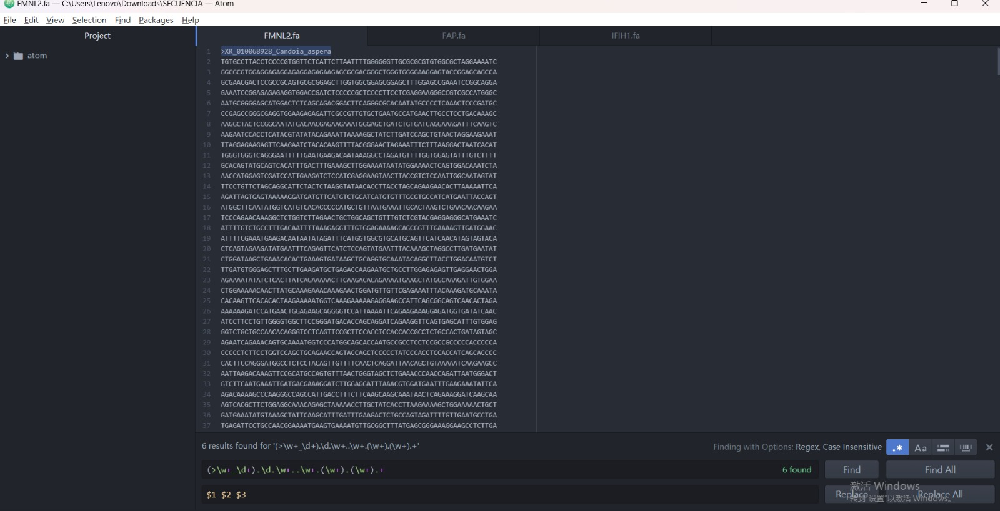
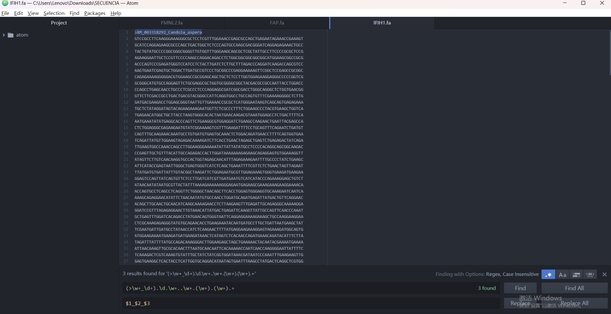
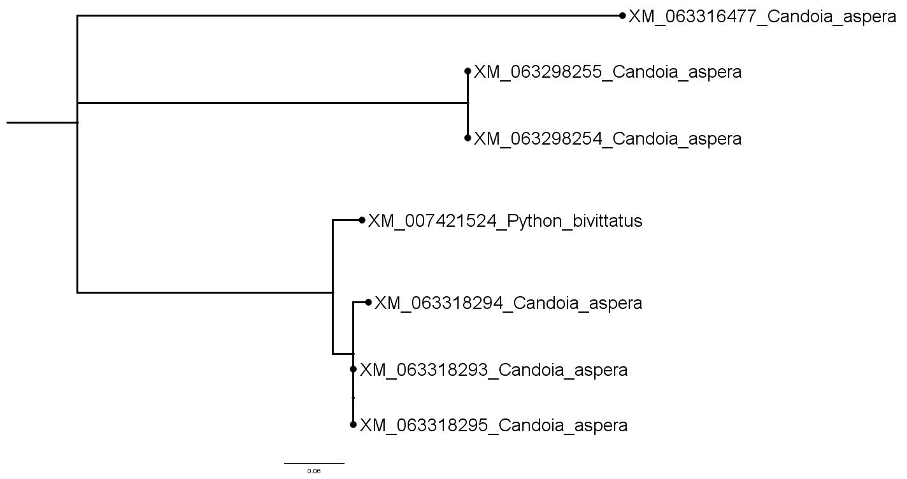
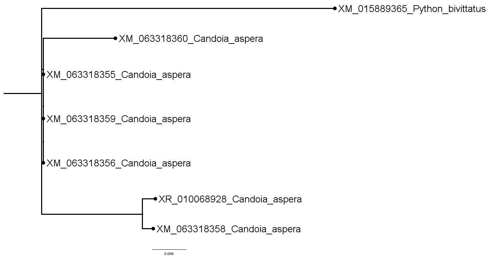

# Reconstrucción filogenética comparativa entre Boidae y Pythonidae

Este proyecto analiza las relaciones filogenéticas de serpientes de las familias **Boidae** y **Pythonidae** mediante tres genes ortólogos: **FAP**, **FMNL2** e **IFIH1**. Las secuencias fueron descargadas desde NCBI, alineadas con **MUSCLE** y analizadas con **IQ-TREE 2**, integrando un solo representante de Pythonidae en cada gen para comparación directa. Los resultados se visualizan con **FigTree**.

---

## Comenzando

Este instructivo te permitirá reproducir el análisis completo, desde la descarga de secuencias hasta la visualización y comparación de los árboles filogenéticos.

---

## Requisitos previos

- Acceso a una supercomputadora con sistema operativo Linux
- Git Bash o terminal habilitada 
- Programas:
  - [`datasets`](https://www.ncbi.nlm.nih.gov/datasets/) de NCBI
  - [`MUSCLE`](https://www.drive5.com/muscle/) para alineamientos
  - [`IQ-TREE 2`](http://www.iqtree.org/) para inferencia filogenética
  - [`FigTree`](http://tree.bio.ed.ac.uk/software/figtree/) para visualización de árboles

---

## Dscarga y procesamiento de secuencias

Se descargaron las secuencias ortólogas de los genes FAP, FMNL2 e IFIH1 para la familia **Boidae** y un único representante de la familia **Pythonidae**. Se renombraron los encabezados para facilitar el análisis y se unieron los archivos fasta de ambas familias.

---

## Ejecución del pipeline

Todo el proceso se encuentra automatizado en el script `PROGRAMA-COMPLETO`, que incluye:

- Descarga de secuencias
- Limpieza y renombrado de encabezados
- Fusión de secuencias entre familias
- Alineamiento con **MUSCLE**
- Reconstrucción de árboles con **IQ-TREE**
- Unificación de resultados en `Alltrees.tree`

---

## Resultados y Analisis

### Visualización de FASTA

**FMNL2**

**FAP**

**IFIH1**

### Árboles filogenéticos generados

**Árbol 1 – Gen FAP**

- El gen FAP muestra una clara separación entre **Pythonidae** (*Python bivittatus*) y **Boidae** (*Candoia aspera*), agrupando a los Boidae en un clado bien definido.

**Árbol 2 – Gen FMNL2**

- El gen FMNL2 no presenta una separación clara entre las familias, ya que Python aparece incrustado en el clado de Boidae. Esto sugiere baja resolución filogenética.

**Árbol 3 – Gen IFIH1**

- IFIH1 separa correctamente a Pythonidae de Boidae y permite distinguir las secuencias internas de *Candoia* de forma clara.

## Conclusión comparativa

**Los genes FAP e IFIH1 demostraron ser adecuados para estudios filogenéticos comparativos entre las familias Boidae y Pythonidae, ya que permiten distinguir claramente las secuencias de ambas. Por el contrario, el gen FMNL2 no ofrece una separación clara entre las familias, lo cual limita su utilidad en este tipo de análisis. En general, los resultados sugieren que FAP e IFIH1 pueden utilizarse como marcadores confiables en estudios evolutivos de serpientes.**

---

## Autores

- **MIAO DUAN JIANG** — Análisis biotecnológico y redacción del proyecto

---

## Licencia

Este proyecto se desarrolla con fines académicos en la carrera de Bioingeniería – PUCE.

---

## Agradecimientos

- Al **Doc. Daniel Chavez** por materia **BIOTECNOLOGÍA Y HERR BIOINFOR** 
- A **NCBI**, **MUSCLE**, **IQ-TREE 2** y **FigTree** por sus recursos abiertos

---

## Imagen del organismo

